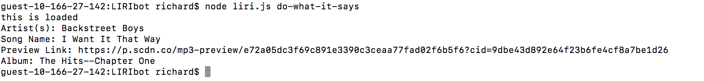

# LIRIbot
The LIRI bot is a Language Interpretation and Recongnition Interface and is a very helpful tool for referencing popular media resources. One enters a command,and then a song, movie, or artist into the terminal. In return you receive more information on that subject in your terminal window.

User Commands:
    • movie-this "movie-name"
    • concert-this "artist-name"
    • spotify-this-song "movie-name"
    • do-what-it-says "N/A"(second command isn't needed)

* node liri.js concert-this 'artist/band name here' will return the following info:
    • Name of the venue
    • Venue location
    • Date of the Event (use moment to format this as "MM/DD/YYYY")

* node liri.js spotify-this-song 'song name here' will return the following info:
    • Artist(s)
    • The song's name
    • A preview link of the song from Spotify
    • The album that the song is from
    • If no song is provided then your program will default to "The Sign" by Ace of Base

* node liri.js movie-this 'movie name here' will return the following info:
    • Title of the movie
    • ear the movie came out
    • IMDB Rating of the movie
    • Rotten Tomatoes Rating of the movie
    • Country where the movie was produced
    • Language of the movie
    • Plot of the movie
    • Actors in the movie
    • If the user doesn't type a movie in, the program will output data for the movie 'Mr. Nobody.'
* node liri.js do-what-it-says will return the following info
    •Using the fs Node package, LIRI will take the text inside of random.txt and then use it to call one of LIRI's commands.
    • specifically spotify-this-song for "I Want it That Way," as follows the text in random.txt

Images of proof:

Format: 

Format: 

Format: 

Format: 

